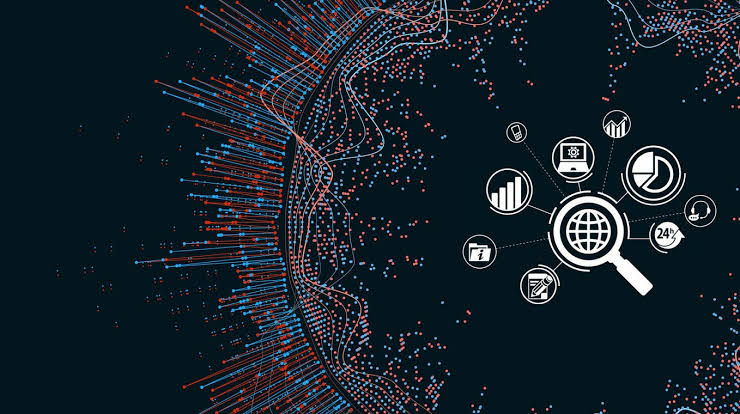
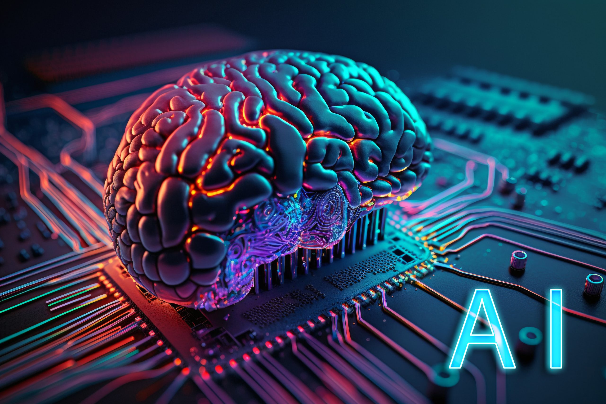

# Nirbhay Sedha

Hello there! 👋 I am Nirbhay Sedha, a passionate Data Scientist and AI Engineer working in the domains of Artificial Intelligence, Machine Learning, Deep Learning, Natural Language Processing, and Computer Vision. I thrive in creating solutions that bridge the gap between cutting-edge technology and real-world applications, particularly in production environments.

## About Me

- 🎓 Currently, I am exploring the depths of AI and Data Science.
- 💼 Working on real-world AI projects in production environments.
- 🌱 Always learning and experimenting with new technologies and frameworks.

## Contact Me

Feel free to get in touch with me via:

- LinkedIn: [ LinkedIn](https://www.linkedin.com/in/nirbhay-sedha-4b103a252/)
- GitHub: [ GitHub](https://github.com/Nirbhaysedha)
- Email: [ Email](mailto:sedha9nirbhay@gmail.com)
- Twitter: [ Twitter](https://twitter.com/sedha9nirbhay)

## Photos

Here are some glimpses from my journey:

 

Feel free to explore my GitHub repositories and connect with me on LinkedIn. Let's collaborate and create something amazing together!

Happy coding! 🚀
